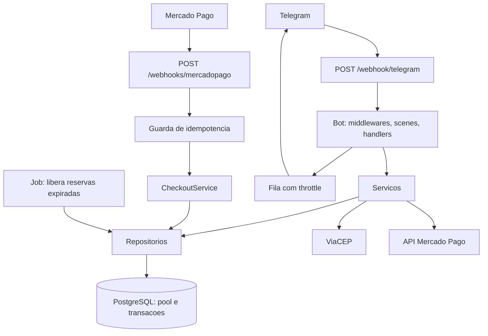

# Grupo Vip — Loja Preço Pop

Bot de e-commerce no Telegram: catálogo com variações, carrinho persistente,
cupons, frete por CEP, checkout transacional via Mercado Pago (Pix, cartão e
boleto), rastreio de entrega e painel administrativo completo.

---

## Sumário

- [Principais recursos](#principais-recursos)
- [Arquitetura](#arquitetura)
- [Estrutura do projeto](#estrutura-do-projeto)
- [Variáveis de ambiente](#variáveis-de-ambiente)
- [Rodando localmente](#rodando-localmente)
- [Migrations](#migrations)
- [Testes e qualidade](#testes-e-qualidade)
- [Docker](#docker)
- [Deploy no Railway](#deploy-no-railway)
- [Webhooks](#webhooks)
- [Modelo de dados](#modelo-de-dados)
- [Decisões de engenharia](#decisões-de-engenharia)
- [Solução de problemas](#solução-de-problemas)

---

## Principais recursos

### Cliente

| Recurso | Detalhe |
|---|---|
| Cadastro com CEP automático | Nome → CPF (validação de dígito verificador) → CEP → **ViaCEP preenche rua, bairro, cidade e UF** → número → complemento. Se o ViaCEP falhar, cai para preenchimento manual sem travar o fluxo. |
| Catálogo paginado | Navegação por botões inline, sem reenviar a lista inteira a cada passo. |
| Variações | Cada produto pode ter tamanhos, cores ou versões com preço e estoque próprios. |
| Carrinho persistente | Sobrevive a reinícios do serviço. Ajuste de quantidade com botões `−`/`+`. |
| Cupons | Percentual, valor fixo ou frete grátis, com vigência, valor mínimo e limite de usos. |
| Frete por UF | Tabela editável pelo admin, com prazo estimado e regra de frete grátis por valor. |
| Checkout transacional | Reserva o estoque, congela preços e endereço no pedido e esvazia o carrinho — tudo em uma transação. |
| Pagamento | Pix com QR Code e copia-e-cola, ou Checkout Pro para cartão e boleto. |
| Meus pedidos | Status, itens, totais detalhados e **código de rastreio** quando enviado. |

### Administrador

| Recurso | Detalhe |
|---|---|
| Produtos e variações | Wizard guiado para criar, editar, ativar e excluir. |
| Cupons | CRUD com validade e limite de uso. |
| Frete | Edição da tarifa e do prazo por UF e do limite de frete grátis. |
| Pedidos | Filtro por status e marcação de envio **com código de rastreio**, notificando o cliente automaticamente. |
| Broadcast | Mensagem com foto opcional, pré-visualização, confirmação, envio com throttle e relatório de entregues/falhas. Quem bloqueou o bot é marcado automaticamente. |
| Relatórios | Faturamento, pedidos pagos e pendentes, ticket médio e ranking de produtos. |

---

## Arquitetura



Camadas, de fora para dentro:

1. **`http/`** — Express: health check, webhook do Telegram e do Mercado Pago.
2. **`bot/`** — middlewares, cenas (wizards) e handlers. Só orquestra e formata.
3. **`services/`** — regras de negócio e transações.
4. **`repositories/`** — SQL. Nenhuma regra de negócio.
5. **`domain/`** — funções puras (CPF, CEP, dinheiro, cupom, assinatura HMAC). Sem I/O, 100% testáveis.
6. **`infra/`** — pool do Postgres, migrator, logger, throttler, session store, cliente ViaCEP.

---

## Estrutura do projeto

```
src/
├── config/env.ts                 Validação das variáveis com zod (falha rápido)
├── domain/                       Regras puras: cpf, cep, money, errors, signature, types
├── infra/
│   ├── logger.ts                 pino estruturado, com CPF e tokens mascarados
│   ├── db/
│   │   ├── pool.ts               pg.Pool + withTransaction()
│   │   ├── migrator.ts           advisory lock + tabela schema_migrations
│   │   └── migrations/*.sql      versionadas, forward-only, idempotentes
│   ├── telegram/
│   │   ├── session-store.ts      sessão do Telegraf persistida no Postgres
│   │   └── throttler.ts          fila 25 msg/s global, backoff em 429
│   └── http/viacep.ts            cliente com timeout e cache em banco
├── repositories/                 users, items, carts, coupons, shipping, orders, webhooks, broadcasts
├── services/                     cart, checkout, payments, shipping, coupons, broadcast
├── bot/
│   ├── middlewares/              sessão, admin guard, carregamento de usuário, rate limit, erros
│   ├── scenes/                   cadastro e wizards do admin
│   ├── handlers/customer/        menu, catálogo, carrinho, checkout, pedidos, perfil
│   ├── handlers/admin/           painel, produtos, pedidos, marketing, broadcast
│   └── ui/                       teclados, escape de HTML e views
├── http/
│   ├── server.ts                 Express, health check e páginas de retorno
│   └── routes/                   webhook do Mercado Pago
├── scripts/migrate.ts            executa as migrations manualmente
└── index.ts                      bootstrap, jobs e shutdown gracioso
tests/
├── unit/                         domínio, cupons, formatação, assinatura HMAC
└── integration/                  migrations, ciclo do pedido, concorrência
```

---

## Variáveis de ambiente

Copie `.env.example` para `.env`. A aplicação valida tudo na inicialização com
`zod` e **falha imediatamente listando exatamente o que está faltando** — nunca
sobe pela metade.

| Variável | Obrigatória | Padrão | Descrição |
|---|---|---|---|
| `TELEGRAM_BOT_TOKEN` | sim | — | Token do @BotFather |
| `TELEGRAM_WEBHOOK_SECRET` | sim | — | 8–256 caracteres `A-Z a-z 0-9 _ -` |
| `ADMIN_CHAT_IDS` | sim | — | IDs de admin separados por vírgula |
| `SHIPPING_GROUP_CHAT_ID` | sim | — | Grupo que recebe os pedidos pagos |
| `MERCADO_PAGO_ACCESS_TOKEN` | sim | — | Access Token (não é a Public Key) |
| `MERCADO_PAGO_WEBHOOK_SECRET` | sim | — | Segredo gerado pelo MP no cadastro do webhook |
| `DATABASE_URL` | sim | — | Conexão PostgreSQL (`postgres://…`) |
| `PUBLIC_URL` | sim | — | URL HTTPS pública base |
| `WEBHOOK_URL` | não | vazio | Vazio em dev; o bot usa long polling |
| `PORT` | não | `3000` | O Railway injeta automaticamente |
| `NODE_ENV` | não | `development` | `development` / `test` / `production` |
| `LOG_LEVEL` | não | `info` | `silent`, `fatal` … `trace` |
| `DATABASE_POOL_MAX` | não | `10` | Conexões simultâneas no pool |
| `DATABASE_SSL` | não | `true` | `false` para Postgres local |
| `PIX_TTL_MINUTES` | não | `30` | Validade do Pix e da reserva de estoque |
| `FREE_SHIPPING_THRESHOLD_CENTS` | não | `0` | Frete grátis acima do valor. `0` desativa |
| `DEFAULT_SHIPPING_CENTS` | não | `2500` | Frete quando a UF não tem tarifa |
| `VIACEP_TIMEOUT_MS` | não | `4000` | Timeout do ViaCEP |
| `SESSION_TTL_DAYS` | não | `30` | Retenção de sessões inativas |
| `STORE_NAME` | não | `Grupo Vip - Loja Preço Pop` | Nome exibido |

> `ADMIN_CHAT_ID` (singular) foi substituído por `ADMIN_CHAT_IDS`, que aceita
> vários administradores. O primeiro da lista recebe os alertas operacionais.

---

## Rodando localmente

Pré-requisitos: **Node.js 20+** e um **PostgreSQL 14+**.

```bash
# 1. Suba um Postgres local (exemplo com Docker)
docker run -d --name precopop-db -p 5432:5432 \
  -e POSTGRES_PASSWORD=postgres -e POSTGRES_DB=precopop postgres:16-alpine

# 2. Configure o ambiente
cp .env.example .env      # no Windows: copy .env.example .env
# preencha TELEGRAM_BOT_TOKEN, MERCADO_PAGO_ACCESS_TOKEN, ADMIN_CHAT_IDS...
# e use DATABASE_SSL=false para o Postgres local

# 3. Instale e rode
npm install
npm run migrate
npm run dev
```

Com `WEBHOOK_URL` vazio o bot usa long polling — não é preciso expor a máquina
na internet para testar o Telegram. Para testar o webhook do Mercado Pago,
use um túnel (`ngrok http 3000`) e aponte `PUBLIC_URL` para a URL gerada.

---

## Migrations

Forward-only, versionadas e idempotentes, em `src/infra/db/migrations/`.

- Rodam **automaticamente na inicialização** (`src/index.ts`).
- Protegidas por `pg_advisory_lock`: com várias réplicas, apenas uma aplica.
- Cada arquivo roda dentro da própria transação — falhou, reverte inteiro.
- O checksum de cada migration aplicada é gravado em `schema_migrations`; alterar
  um arquivo já aplicado gera aviso no log em vez de reaplicar silenciosamente.

Execução manual:

```bash
npm run migrate
```

Para criar uma nova, adicione `0NN_descricao.sql` na pasta de migrations. Nunca
edite uma migration já aplicada em produção — crie a próxima.

---

## Testes e qualidade

```bash
npm run lint          # ESLint
npm run format:check  # Prettier
npm run typecheck     # tsc em src/ e tests/
npm test              # testes unitários (não precisam de banco)
npm run build         # compila e copia as migrations para dist/

npm run test:integration   # exige DATABASE_URL apontando para um Postgres de teste
```

Os testes de integração validam, contra um PostgreSQL real:

- todas as migrations e os índices críticos;
- o ciclo completo do pedido (reserva → pagamento → baixa de estoque);
- **venda concorrente do último item** — 10 compradores disputando 3 unidades;
- corrida pelo último uso de um cupom limitado;
- idempotência do webhook sob entregas simultâneas;
- devolução de estoque e de uso de cupom em cancelamento e expiração.

> Eles executam `TRUNCATE` nas tabelas. **Nunca** aponte `DATABASE_URL` para
> produção ao rodá-los.

O workflow `.github/workflows/ci.yml` roda lint, formatação, typecheck, testes
unitários, build, testes de integração (com serviço PostgreSQL) e o build da
imagem Docker a cada push e pull request.

---

## Docker

Build multi-stage, runtime enxuto, usuário não-root e `dumb-init` para que o
`SIGTERM` chegue ao Node e o shutdown gracioso funcione.

```bash
docker build -t preco-pop-bot .
docker run --env-file .env -p 3000:3000 preco-pop-bot
```

---

## Deploy no Railway

1. **Banco**: *New → Database → PostgreSQL*.
2. **Variáveis** do serviço do bot:
   - `DATABASE_URL` → use a referência `${{Postgres.DATABASE_URL}}`
   - `DATABASE_SSL=true`
   - `PUBLIC_URL` e `WEBHOOK_URL` → `https://<seu-dominio>.up.railway.app`
   - demais variáveis da tabela acima
   - **não** crie `PORT` manualmente; o Railway injeta.
3. **Deploy**: a infraestrutura é declarada em `.railway/railway.ts`
   (Infrastructure as Code) — builder, build command, start command, health
   check e o inventário de variáveis do serviço. Para revisar e aplicar:

   ```bash
   npm install
   railway config plan    # somente leitura, mostra o que mudaria
   railway config apply   # aplica após confirmação
   ```

   Com o código e o Railway em sincronia, o `plan` termina em
   *already up to date*.
4. **Verifique**: `curl https://<seu-dominio>.up.railway.app/health` deve
   retornar `{"status":"ok","database":"up"}`. Se vier `503`, o Postgres não
   está acessível — confira `DATABASE_URL` e `DATABASE_SSL`.

As migrations rodam sozinhas no boot; não há passo manual no deploy.

> O `railway.json` (Config as Code) foi descontinuado pelo Railway e deixa de
> ser lido em 2026-12-01, então a configuração foi migrada para
> `.railway/railway.ts`. Os valores das variáveis continuam no Railway: o
> arquivo usa `preserve()`, de modo que nenhum segredo é versionado.

---

## Webhooks

### Telegram

Configurado automaticamente na inicialização quando `WEBHOOK_URL` está definido,
já com `secret_token`. Toda requisição sem o header
`x-telegram-bot-api-secret-token` correto é rejeitada.

Caminho: `POST /webhook/telegram`

### Mercado Pago

No painel do MP, cadastre a URL abaixo e assine o evento **payment**:

```
https://<seu-dominio>.up.railway.app/webhooks/mercadopago
```

Copie o segredo gerado para `MERCADO_PAGO_WEBHOOK_SECRET`.

Proteções aplicadas:

- o corpo é lido **bruto** (`express.raw`) antes de qualquer parser JSON, para
  que a assinatura seja conferida sobre os bytes originais;
- HMAC-SHA256 comparado em tempo constante, com checagem de tamanho antes;
- tabela `processed_webhooks` com `UNIQUE (provider, event_id)`: reenvio do
  mesmo evento não duplica estoque nem notificação.

### Endpoints

| Método | Rota | Uso |
|---|---|---|
| `GET` | `/health` | Health check com verificação real do banco |
| `GET` | `/` | Identificação do serviço |
| `POST` | `/webhook/telegram` | Updates do Telegram |
| `POST` | `/webhooks/mercadopago` | Notificações de pagamento |
| `GET` | `/pagamento/{sucesso,pendente,falha}` | Páginas de retorno do Checkout Pro |

---

## Modelo de dados

| Tabela | Papel |
|---|---|
| `users` | Cadastro com endereço estruturado (rua, número, bairro, cidade, UF) |
| `items` / `item_variants` | Produto e suas variações, com preço e estoque próprios |
| `carts` / `cart_items` | Carrinho persistente por usuário |
| `coupons` | Percentual, fixo ou frete grátis, com vigência e limite de usos |
| `orders` / `order_items` | Pedido com totais detalhados e snapshot de preço e endereço |
| `shipping_rates` | Tarifa e prazo por UF |
| `processed_webhooks` | Idempotência por `(provider, event_id)` |
| `sessions` | Sessão do Telegraf persistida |
| `broadcasts` / `broadcast_targets` | Campanha e status por destinatário |
| `cep_cache` | Respostas do ViaCEP |
| `schema_migrations` | Controle de versão do schema |

### Controle de estoque

`disponível = stock − reserved`

1. O checkout abre uma transação e trava as variações com `SELECT ... FOR UPDATE`,
   sempre na ordem do `id` (evita deadlock entre compras simultâneas).
2. Revalida disponibilidade e preço com o registro travado; se mudou, aborta.
3. `reserved += qty` e o pedido recebe `expires_at`.
4. Pagamento aprovado → `stock −= qty` e `reserved −= qty`, na mesma transação.
5. Cancelado ou expirado → `reserved −= qty` e o uso do cupom é devolvido.

Um job a cada 60 segundos varre pedidos pendentes vencidos e devolve a reserva —
sem ele, o estoque reservado nunca voltaria para a vitrine.

---

## Decisões de engenharia

- **PostgreSQL exclusivo.** O suporte duplo a SQLite era a origem de bugs reais
  em produção (`lastID` inexistente no `pg`, conversão manual de `?` para `$n`
  quebrando com textos que contêm `?`).
- **Sessão no banco.** O Railway reinicia o serviço a cada deploy; sessão em
  memória apagaria cadastros e carrinhos em andamento.
- **HTML em vez de Markdown.** Título de produto com `*` ou `_` quebra o
  `parse_mode: Markdown`. Todo texto dinâmico passa por `esc()`.
- **Throttler próprio.** Fila global de 25 msg/s e ~1 msg/s por chat, respeitando
  o `retry_after` do erro 429 — o broadcast em massa não derruba o bot.
- **Reserva de estoque em duas fases.** Debitar só na aprovação do pagamento
  permitiria vender o mesmo item para vários compradores durante a janela do Pix.
- **Erros de domínio tipados.** `ValidationError`, `NotFoundError`,
  `ConflictError`, `OutOfStockError` e `PaymentError` viram mensagem amigável no
  Telegram; qualquer outro erro é logado e responde com um texto genérico, sem
  vazar stack trace.
- **Logs com dados sensíveis mascarados.** CPF e tokens nunca aparecem em claro.

---

## Solução de problemas

| Sintoma | Causa provável | O que fazer |
|---|---|---|
| App não sobe e lista variáveis no log | Configuração incompleta | Preencha o que o log indicar; compare com `.env.example` |
| `/health` retorna `503` | Banco inacessível | Confira `DATABASE_URL` e `DATABASE_SSL` (`true` no Railway) |
| Webhook do MP retorna `401` | Assinatura inválida | Refaça o cadastro do webhook e atualize `MERCADO_PAGO_WEBHOOK_SECRET` |
| Bot não responde com webhook ativo | `WEBHOOK_URL` errado ou sem HTTPS | Use a URL pública HTTPS completa, sem barra final |
| Produto não aparece no catálogo | Sem estoque disponível | `stock − reserved` precisa ser maior que zero; verifique reservas pendentes |
| Broadcast com muitas falhas | Usuários que bloquearam o bot | Eles são marcados automaticamente e excluídos dos próximos envios |

---

## Licença

MIT
